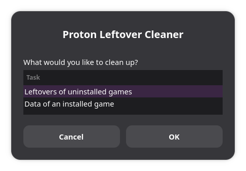

# Proton Leftover Cleaner

When Steam runs a Windows game on Linux through Proton, it creates two folders for that game:

- a **Proton prefix** (`steamapps/compatdata/<App ID>`): the game's own little Windows installation, with its settings and often its save files
- a **shader cache** (`steamapps/shadercache/<App ID>`): precompiled graphics shaders

Uninstalling a game often leaves both behind. Over time they can add up to many gigabytes. Proton Leftover Cleaner finds them, tells you which game they belonged to and how big they are, and removes the ones you select.



## Features

- **Leftovers of uninstalled games:** lists every Proton prefix and shader cache whose game isn't installed anymore, with name, App ID, type and size. Everything is preselected. Untick what you want to keep, confirm, done.
- **Removed non-Steam games:** data of non-Steam games you've removed from Steam is found too. Non-Steam games that are still in your library are never touched.
- **Proton data without a game:** the `compatdata/0` folder that sometimes appears is listed as well.
- **Data of an installed game:** reset the shader cache and/or Proton prefix of a game that's still installed, for example to fix a game that stopped starting. Steam recreates them on the next launch.
- **Finds all your libraries:** reads Steam's own list of libraries, so internal drives, external drives, SD cards and custom folders all work, with regular and Flatpak Steam.
- **Works offline:** game names come from Steam's local cache. Nothing is sent anywhere.
- **Terminal mode:** `--list` shows all leftovers without deleting anything.

## Installation

### AppImage (recommended)

Download `Proton_Leftover_Cleaner-<version>-x86_64.AppImage` from the [latest release](../../releases/latest).

- **With an AppImage manager** (like AppManager or Gear Lever): open the AppImage with it. Proton Leftover Cleaner appears in your app menu, and updates are found automatically.
- **Without one:** make the file executable (right-click → Properties → Permissions → "Is executable") and double-click it.

To check the download, put the matching `.sha256` file next to it and run:

```
sha256sum -c Proton_Leftover_Cleaner-<version>-x86_64.AppImage.sha256
```

### Plain script

Download `proton-leftover-cleaner.sh`, make it executable and run it:

```
chmod +x proton-leftover-cleaner.sh
./proton-leftover-cleaner.sh
```

### Requirements

- **zenity** for the windows (preinstalled on most desktops, including SteamOS and Bazzite)
- **python3** for game names and for recognizing non-Steam games (also usually preinstalled). Without it, leftovers are shown by App ID only and non-Steam game data is left alone.

## Usage

Start the app and choose:

1. **Leftovers of uninstalled games:** the app scans your libraries and shows what it found. Untick anything you want to keep and click OK. You'll see how much space will be freed before anything is removed.
2. **Data of an installed game:** pick a game, then choose to remove its shader cache, its Proton prefix, or both.

In a terminal:

```
proton-leftover-cleaner.sh --list      # show leftovers, delete nothing
proton-leftover-cleaner.sh --help
```

## Please note

- **Removal is permanent:** removed folders are deleted right away, not moved to the trash. There's no undo.
- **Save files:** many games store their saves inside the Proton prefix. Removing it deletes saves that aren't synced with Steam Cloud. Back them up first if you're unsure.
- **Non-Steam games installed inside their prefix:** removing such a leftover removes the game files as well.
- **Steam running:** before resetting the data of an installed game, the app warns you if Steam is running. Close the game first.
- **Drives that aren't connected:** if one of your Steam libraries is on a drive that isn't plugged in, its games look uninstalled. The app warns you about this before scanning.
- Shader caches are always safe to remove. Steam rebuilds them when needed.

## Building the AppImage

```
bash packaging/appimage/build.sh
```

The AppImage, its `.sha256` checksum and a `.zsync` file (used by AppImage updaters) end up in the `build` folder. The version number comes from `APP_VERSION` in `proton-leftover-cleaner.sh`.

## License

Public domain, via [The Unlicense](LICENSE). Use it, change it and share it however you like.
